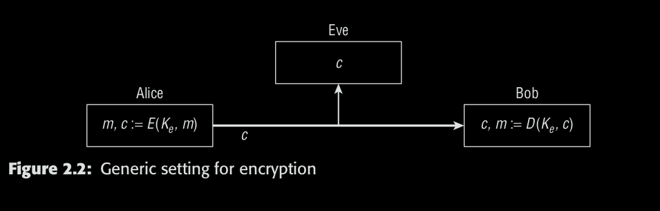
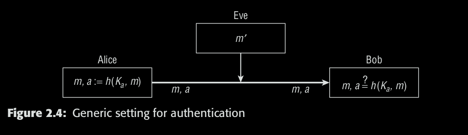
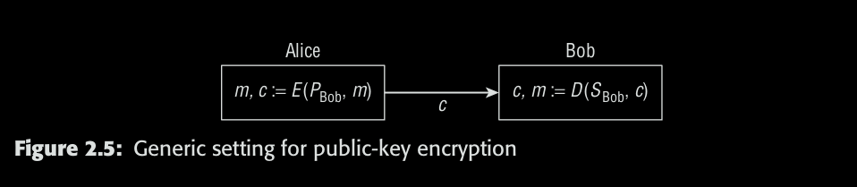
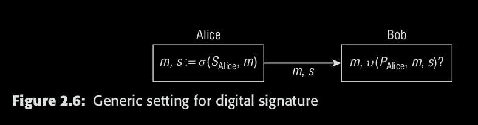

* m: Massage (plaintext)  
* Ke: Key  
* E: Encryption function  
* c: ciphertext  
* D: Decryption function

## Kerckhoffs’ Principle
* Algorithms should be published

## Authentication

* Ka: Authentication Key
* m: Message
* a: Message Authentication code (MAC)
* h: MAC function

## Public-Key Encryption

* Sbob: secret key from Bob
* Pbob: public key from Bob
* m: message
* c: ciphertext
* E: Encryption algorithm
* D: Decryption algorithm
* D(SBob , E(PBob , m)) = m (must hold for all
possible messages m)

## Digital Signatures

* SAlice: Alice's secret key
* PAlice: Alice's public key
* m: message
* s: signature
* v: verification algorithm
* σ: compute

## PKI (public key infrastructure)
* Verify public key belong to the right person
* Use a central authority called the certificate authority,
or CA.
* Takes public key to the CA and identifies himself to the
CA

## Attack
### The Ciphertext-Only Model
* Try to break encryption algorithm
* Hardest to do

